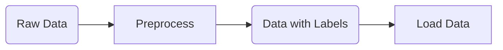

# Arcitecture

```mermaid
graph LR;
    D1(Raw Data)-->C1[Preprocess]
    C1 --> D2(Data with Labels);
    D2 --> C2[Load Data];
```

# References
https://detectron2.readthedocs.io/en/latest/tutorials/install.html#build-detectron2-from-source